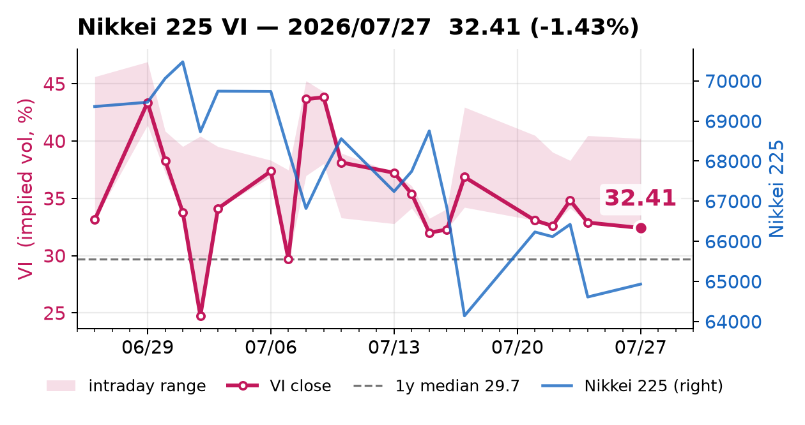

# 日経平均VI → Teams bot

平日の夕方、**日経平均VI（日経平均ボラティリティー・インデックス）**の終値を、
文脈の数値とチャート付きで Microsoft Teams に投稿します。



## 投稿される内容

- **VI終値** と前日比（上昇＝赤、下落＝緑）
- **水準の意味づけ**：過去1年・3年での位置（パーセンタイル）、1年中央値、
  パーセンタイル基準の状態ラベル（平常レンジ／やや高い／警戒 など）
- **1週間前比・1ヶ月前比**、当日の**日中レンジ**（始値・高値・安値）
- **実現ボラとの差**：VI（予想変動率）− 日経225の実現ボラ20日（実際の変動率）
- **日経225との20日相関**（−1に近いほど逆行）
- **同時に動いた主要指標**：日経225・ドル円・米VIX・S&P500・米10年金利
- **チャート**：直近1ヶ月のVI（終値＋日中レンジ）と日経225の重ね描き。
  **クリックすると拡大表示**されます（画像の `selectAction` ＋ 予備のボタン。
  一部のTeamsクライアントは画像クリックを無視するため両方用意しています）

> **重要：因果ではありません。**
> 「同時に動いた指標」は相関の提示であって、VIが動いた *理由* ではありません。
> 相場の因果は本質的に推測なので、このボットは意図的に解釈を書きません。
> 判断材料の提示までが役割です。

## データ源（すべて無料・APIキー不要）

| データ | 取得元 |
|---|---|
| 日経平均VI 日次OHLC（2023年〜） | [日経平均プロフィル](https://indexes.nikkei.co.jp/nkave/index/profile?idx=nk225vi) の CSV `nikkei_stock_average_vi_daily_jp.csv` |
| 日経225 日次OHLC | 同サイト `nikkei_stock_average_daily_jp.csv` |
| ドル円・米VIX・S&P500・米10年金利 | Yahoo Finance chart API |

日経のCSVは **Shift-JIS**、列は `データ日付, 終値, 始値, 高値, 安値`、
末尾に著作権表記の行が入るのでスキップしています。
（列の並びは公式ページの表示値と突き合わせて検証済み）

## スケジュールと重複防止

- 平日 **19:00 JST** を本命に、20:00 / 21:00 / 21:45 JST で再試行します。
  VIの日次CSVの更新が **18:24 JST 頃**だったため、19時が最初の安全枠です。
- 全スロットを **22:30 JST（米国市場の寄り付き）より前**に収めています。
  それ以降に走ると、Yahoo の最新日足が「取引中の未確定値」になり、
  終値のように見えてしまうためです。
- 米国の指標は日本より後に引けるので、**観測日を必ず併記**します
  （例：`米VIX（07/27）`）。
- GitHub の cron は時刻を保証しません（数時間遅れることも、実行が落ちることも
  あります）。そのため「今日かどうか」ではなく **レートの日付**で重複判定し、
  `state/last_posted.txt` に記録して**同じ日付は1回だけ**投稿します。
  土日祝は新しい日付が出ないので自動的に何も投稿しません。

## なぜこのリポジトリは公開なのか

Teams のカードに画像を表示するには、画像が**公開URL**である必要があります
（非公開リポジトリの画像は Teams から取得できません）。そのため毎回
`charts/latest.png` をコミットし、`raw.githubusercontent.com` 経由で参照しています。

公開されるのはコードと市場データのグラフだけです。**Teams の Webhook URL は
GitHub の暗号化シークレット**（`TEAMS_WEBHOOK_URL`）に入っており、公開されません。

## ファイル

| ファイル | 役割 |
|---|---|
| `vi_bot.py` | 取得 → 集計 → チャート生成 → カード投稿 |
| `.github/workflows/vi.yml` | スケジュール実行と手動実行 |
| `charts/latest.png` | 最新チャート（毎回更新・Teams が参照） |
| `state/last_posted.txt` | 重複防止用の最終投稿日 |

## 手元で動かす

```bash
# 取得・集計・チャート生成だけ（投稿しない。カードJSONを表示）
python vi_bot.py --dry-run

# 実際に投稿する
TEAMS_WEBHOOK_URL="https://..." python vi_bot.py

# すでに投稿済みの日付でも強制的に投稿する
ALWAYS_POST=1 TEAMS_WEBHOOK_URL="https://..." python vi_bot.py
```

チャートのラベルを英語にしているのは、GitHub の実行環境に日本語フォントが
入っておらず、毎回インストールすると遅く壊れやすいためです（`Nikkei 225
Volatility Index` は金融では標準表記）。

### チャートの見た目を変えるときの注意

Teams は画像を **約450px幅に縮小**して表示します。効いてくるのは絶対的な
ピクセル数ではなく「**図の幅に対する文字の大きさの比率**」です。
そのため `figsize` は小さめ（7×3.7インチ）にして `dpi` を上げ（180）、
フォントは大きめ（11〜15pt）にしてあります。
`figsize` を大きくしたうえで同じフォントサイズにすると、縮小表示で文字が
潰れて読めなくなります（実際に最初はそうなっていました）。

画像URLには `?v=<日付>-<内容のハッシュ>` を付けています。これが無いと、
同じ日にチャートを作り直しても URL が変わらず、Teams のキャッシュが
古い画像を表示し続けます。

## 手動実行 / つまずいたとき

- **今すぐ動かす**：Actions タブ → *Nikkei VI Teams notifier* → *Run workflow*
  （`always_post` にチェックを入れると、投稿済みの日付でも再投稿します）
- **カードは来るが画像が出ない**：`charts/latest.png` が公開URLで見えるか、
  リポジトリが公開のままか確認してください。
- **60日ルール**：GitHub は、リポジトリが60日間まったく更新されないと
  スケジュール実行を自動停止します。このボットは毎日チャートをコミットするので
  通常は止まりませんが、長期休止後は Actions タブから再有効化が必要です。
